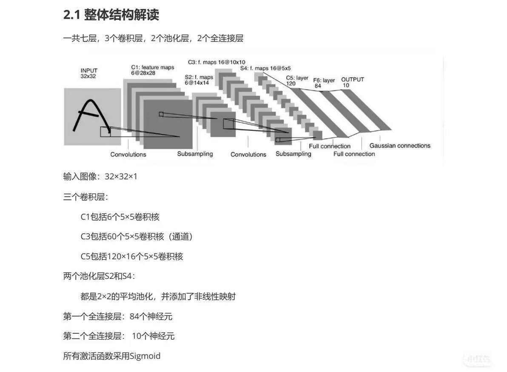
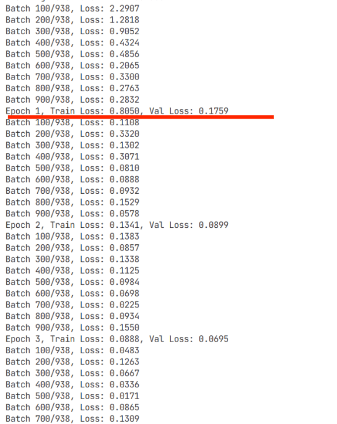
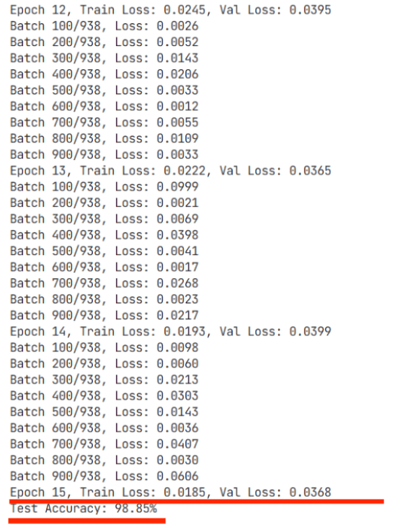

# LeNet-5 实现MNIST手写数字识别任务


## 实现方案

### 1. 数据准备
- 使用 PyTorch 内置的 MNIST 数据集(是手写数字识别任务的标准数据集，包含60,000张训练样本和10,000张测试样本，每个样本是一个28x28x1的灰度图像)
- 对数据进行预处理：
  - 调整图像尺寸为 32x32x1（LeNet-5 要求的输入尺寸）  
  ```python
  from torchvision import transforms

  transform = transforms.Compose([
      transforms.ToTensor(),
      transforms.Resize((32, 32))
  ])
  ```
  - 转换为张量格式（将灰度图像转换为 PyTorch 张量格式）
  ```python
  transform = transforms.Compose([
      transforms.ToTensor(),
      transforms.Normalize((0.5,), (0.5,))
  ])
  ```
  

### 2. 模型架构
按照 LeNet-5 架构实现：
- **输入层**：32x32x1（单通道灰度图像）
- **卷积层 C1**：6个5x5卷积核，步长1，无填充
- **池化层 S2**：2x2最大池化，步长2
- **卷积层 C3**：16个5x5卷积核，步长1，无填充
- **池化层 S4**：2x2最大池化，步长2
- **卷积层 C5**：120个5x5卷积核，步长1，无填充
- **全连接层 F6**：84个神经元
- **输出层**：10个神经元（对应0-9数字）
- **激活函数**：所有层使用Sigmoid激活函数


完全按照论文模型框架，除了用最大池化层替换平均池化层，其他层的参数保持不变。

### 3. 训练策略
- 损失函数：交叉熵损失（因为是多分类任务，每个样本有10个类别，所以损失函数为交叉熵损失函数）
  ```math
  L = -\frac_{i=1}^{N} \sum_{j=1}^{10} y_{i,j} \log p_{i,j}
  ```
- 优化器：Adam 优化器，学习率 0.001（Adam可以自动调整学习率）
- 批次大小：32batch
- 训练轮数：15epoch


## 运行结果

### 生成文件
- `lenet5_model.pth`：训练好的 LeNet-5 模型参数文件
- `data/MNIST/`：下载的 MNIST 数据集文件

### 模型性能
- **测试集准确率**：达到95%以上，效果良好。


可以看到，随着训练轮数的增加，模型的测试集准确率也在增加，且在最后达到95%以上。并且Loss随着训练轮数的增加而一直下降，或许可以提升轮次观察什么时候Loss和准确率都趋于稳定。

- **损失曲线**：通过观察训练集和验证集损失曲线，可以看出除了最开始的轮次训练集Loss较高，后面训练集和验证集损失曲线都十分接近，说明模型没有过拟合。
- **新预测**：生成的`predictions.png`文件，展示了模型在测试集上的预测结果，可以看出模型预测全对，没有错误预测。

## 模型实现

1. **卷积神经网络的核心模块**：
   - 卷积层：通过卷积核提取局部特征（感受野=卷积核大小*步长），通过层层堆叠，提取出更复杂的特征表示
   - 池化层：降低特征维度，对每个通道做下采样（平均池化：取池化区域的平均值，最大池化：取池化区域的最大值），缩小特征图高和宽不改变通道数，减少参数量
   - 全连接层：将提取的特征映射到输出类别
   - 激活函数：（原论文使用Sigmoid激活函数，是因为时代限制，现在一般使用ReLU激活函数，因为ReLU激活函数在训练时更稳定）但为了保持与原论文一致，这里也使用Sigmoid激活函数

2. **数据预处理**：
   - 图像尺寸调整：确保输入尺寸符合模型要求，这里调整为32x32x1
   - 转换为张量格式：将灰度图像转换为 PyTorch 张量格式
   - 归一化：防止像素值范围过大或过小，导致模型训练不稳定，提高训练效果（将像素值归一化到[-1, 1]范围）

3. **训练参数设置**：
   - 选择合适的损失函数和优化器（原论文使用交叉熵损失函数和Adam优化器）
   - 合理设置批次大小和学习率（原论文使用32batch，0.001学习率）

## 拓展任务

1. **探索其他经典 CNN 架构**：
- **核心差异**：
  | 模型 | 网络深度 | 核心创新 | 适用场景 |
  |------|----------|----------|----------|
  | LeNet-5 | 5层 | 卷积+池化结构 | 简单图像识别 |
  | AlexNet | 8层 | ReLU激活、Dropout | 复杂图像识别 |
  | ResNet18 | 18层 | 残差连接 | 深层特征提取 |

   - AlexNet：更深的网络结构（8层），引入ReLU激活函数解决了梯度消失问题，同时使用Dropout和数据增强防止过拟合，提高了模型的泛化能力

```python
# AlexNet模型
class AlexNet(nn.Module):
    def __init__(self):
        super(AlexNet, self).__init__()
        self.features = nn.Sequential(
            nn.Conv2d(3, 64, kernel_size=11, stride=4, padding=2),
            nn.ReLU(inplace=True),
            nn.MaxPool2d(kernel_size=3, stride=2),
            nn.Conv2d(64, 192, kernel_size=5, padding=2),
            nn.ReLU(inplace=True),
            nn.MaxPool2d(kernel_size=3, stride=2),
            nn.Conv2d(192, 384, kernel_size=3, padding=1),
            nn.ReLU(inplace=True),  
            nn.Conv2d(384, 256, kernel_size=3, padding=1),
            nn.ReLU(inplace=True),  
            nn.Conv2d(256, 256, kernel_size=3, padding=1),
            nn.ReLU(inplace=True),      
            nn.MaxPool2d(kernel_size=3, stride=2),
        )
        self.classifier = nn.Sequential(
            nn.Dropout(),
            nn.Linear(256 * 6 * 6, 4096),
            nn.ReLU(inplace=True),
            nn.Dropout(),
            nn.Linear(4096, 4096),
            nn.ReLU(inplace=True),    
            nn.Linear(4096, 10),
        )
    
   def forward(self, x):
      x = self.features(x)
      x = x.view(x.size(0), 256 * 6 * 6)
      x = self.classifier(x)
      return x 
```

   - VGG：使用小卷积核（3x3）堆叠替代大卷积核（19层/16层）
  （这个没做）
   - ResNet：引入残差连接，让信息在层间传递，解决深层网络训练困难的问题
```python
# ResNet的核心模块（残差连接）
class BasicBlock(nn.Module):
    expansion = 1 # 残差连接的通道数倍数
    
    def __init__(self, in_channels, out_channels, stride=1):
        super(BasicBlock, self).__init__()
        self.conv1 = nn.Conv2d(in_channels, out_channels, kernel_size=3, stride=stride, padding=1, bias=False)
        self.bn1 = nn.BatchNorm2d(out_channels)# 归一化层1
        self.conv2 = nn.Conv2d(out_channels, out_channels, kernel_size=3, stride=1, padding=1, bias=False)
        self.bn2 = nn.BatchNorm2d(out_channels)# 归一化层2
        
        self.shortcut = nn.Sequential()# 残差连接
        if stride != 1 or in_channels != self.expansion * out_channels:
            # 当步长不是1或输入通道数不是输出通道数的倍数时，需要添加卷积层和归一化层使维度匹配才能进行残差连接
            self.shortcut = nn.Sequential(
                nn.Conv2d(in_channels, self.expansion * out_channels, kernel_size=1, stride=stride, bias=False),
                nn.BatchNorm2d(self.expansion * out_channels)
            )
    
    def forward(self, x):
        out = nn.functional.relu(self.bn1(self.conv1(x)))
        out = self.bn2(self.conv2(out))
        out += self.shortcut(x)
        out = nn.functional.relu(out)
        return out

# ResNet模型（主卷积路径）
class ResNet(nn.Module):
    def __init__(self, block, num_blocks, num_classes=10):
        super(ResNet, self).__init__()
        self.in_channels = 64
        
        self.conv1 = nn.Conv2d(3, 64, kernel_size=3, stride=1, padding=1, bias=False)
        self.bn1 = nn.BatchNorm2d(64)
        self.layer1 = self._make_layer(block, 64, num_blocks[0], stride=1)
        self.layer2 = self._make_layer(block, 128, num_blocks[1], stride=2)
        self.layer3 = self._make_layer(block, 256, num_blocks[2], stride=2)
        self.layer4 = self._make_layer(block, 512, num_blocks[3], stride=2)
        self.linear = nn.Linear(512 * block.expansion, num_classes)
    
    def _make_layer(self, block, out_channels, num_blocks, stride):
        strides = [stride] + [1] * (num_blocks - 1)
        layers = []
        for stride in strides:
            layers.append(block(self.in_channels, out_channels, stride))
            self.in_channels = out_channels * block.expansion
        return nn.Sequential(*layers)
    
    def forward(self, x):
        out = nn.functional.relu(self.bn1(self.conv1(x)))
        out = self.layer1(out)
        out = self.layer2(out)
        out = self.layer3(out)
        out = self.layer4(out)
        out = nn.functional.avg_pool2d(out, 4)
        out = out.view(out.size(0), -1)
        out = self.linear(out)
        return out
```

2. **处理彩色图像**：（非常简单，用的resnet模型）  

- **输入通道**：从1（灰度）改为3（RGB）
```python
self.conv1 = nn.Conv2d(3, 6, kernel_size=5, stride=1, padding=0)
```
- **数据预处理**：调整归一化参数以适应彩色图像
```python
self.bn1 = nn.BatchNorm2d(6)
```
- **模型调整**：修改第一层卷积层的输入通道数
```python
self.in_channels = 64
```

3. **模型优化**：
   
- **数据增强**：通过随机变换增加数据多样性（如旋转、平移、缩放等）
```python
self.transform = transforms.Compose([
    transforms.RandomRotation(10),# 随机旋转10度
    transforms.RandomResizedCrop(224, scale=(0.8, 1.0)),# 随机裁剪224x224的图像
    transforms.RandomHorizontalFlip(),# 随机水平翻转
    transforms.ToTensor(),# 将图像转换为张量
    transforms.Normalize(mean=[0.485, 0.456, 0.406], std=[0.229, 0.224, 0.225])# 归一化图像
])
```
- **Dropout**：随机失活部分神经元，防止模型过度依赖训练集的特定特征导致过拟合
```python
self.classifier = nn.Sequential(
    nn.Dropout(),
    nn.Linear(256 * 6 * 6, 4096),#默认失活率0.5
    nn.ReLU(inplace=True),
    nn.Dropout(),
    nn.Linear(4096, 4096),
    nn.ReLU(inplace=True),    
    nn.Linear(4096, 10),
)
```
- **L2正则化**：对模型参数添加惩罚项，防止参数过大
```python
self.optimizer = optim.SGD(self.parameters(), lr=0.01, momentum=0.9, weight_decay=0.0005)
```
- **批量归一化**：加速训练收敛
