# 目标函数拟合

## 任务描述
对目标函数  z = 2x^4 + y^2 + e^{x^2} + 6 进行拟合：
1. 使用matplotlib绘制该函数在 [-1,1] 范围内的3D曲面图
2. 使用PyTorch构建一个MLP来拟合这个函数
3. 在拟合函数时，加入"添加噪声的数据集"，观察模型是拟合了函数本身还是拟合了噪声
4. 记录不同学习率（0.1, 0.01, 0.001, 0.0001）下Loss下降的曲线
5. 尝试不同的网络组件
6. 将取值范围扩大到 [-5,5] ，观察模型表现

## 实现代码

```python


# 目标函数
def target_function(x, y):
    return 2 * x**4 + y**2 + np.exp(x**2) + 6


# 构建MLP模型
class MLP(nn.Module):
    def __init__(self, hidden_size=64, num_layers=3):
        super(MLP, self).__init__()
        layers = []
        layers.append(nn.Linear(2, hidden_size))
        layers.append(nn.ReLU())
        
        for _ in range(num_layers - 1):
            layers.append(nn.Linear(hidden_size, hidden_size))
            layers.append(nn.ReLU())
        
        layers.append(nn.Linear(hidden_size, 1))
        self.model = nn.Sequential(*layers)
    
    def forward(self, x):
        return self.model(x)


# 训练模型
def train_model(model, train_loader, learning_rate, epochs=200):
    criterion = nn.MSELoss()
    optimizer = optim.SGD(model.parameters(), lr=learning_rate)
    loss_history = []
    
    for epoch in range(epochs):
        total_loss = 0
        for batch_X, batch_y in train_loader:
            optimizer.zero_grad()
            outputs = model(batch_X)
            loss = criterion(outputs, batch_y)
            loss.backward()
            optimizer.step()
            total_loss += loss.item()
        
        avg_loss = total_loss / len(train_loader)
        loss_history.append(avg_loss)
        
        if (epoch + 1) % 20 == 0:
            print(f'Epoch [{epoch+1}/{epochs}], Loss: {avg_loss:.4f}')
    
    return loss_history

# 测试模型
def test_model(model, test_X, test_y):
    model.eval()
    with torch.no_grad():
        predictions = model(test_X)
        mse = nn.MSELoss()(predictions, test_y)
        print(f'Test MSE: {mse.item():.4f}')
    return mse.item()

```

## 观察结论

### 1. 学习率对模型训练的影响
- **学习率为0.1**：Loss相比较起来震荡较大，收敛速度迅速，最终测试MSE较高，约为0.1292。
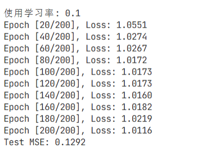
- **学习率为0.01**：Loss变化较为平稳，收敛速度适中，最终测试MSE约为0.0231。
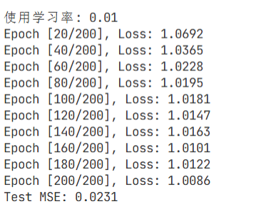
- **学习率为0.001**：Loss平稳下降，收敛速度较慢但稳定，最终测试MSE最低约为0.0081。
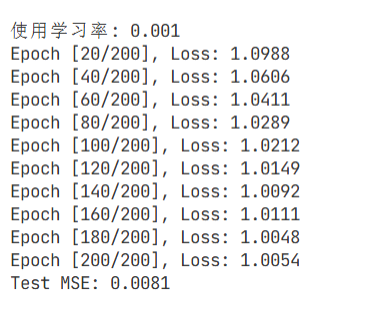
- **学习率为0.0001**：Loss下降到平稳点批次明显大于其他，收敛速度明显慢于其他学习率，最终测试MSE并未收敛到最低，而是升高到0.0947。
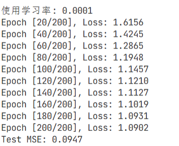

**结论**：学习率过大容易导致模型震荡从而导致mse较高，训练效果不好；学习率过小则收敛缓慢，且mse并未继续随着学习率降低而减少反而升高（可能陷入了局部最优解），0.001左右的学习率在这个任务中表现最好；但Loss下降曲线只在前25个epoch中有明显差别，后续变化较小，可能因为这个函数较简单，模型的拟合完全能力足够甚至超过，只需要25个epoch即可收敛到最低值。

### 2. 网络结构对模型性能的影响
- **隐藏层大小**：
  - 32个神经元：测试MSE较低，拟合能力最好。
  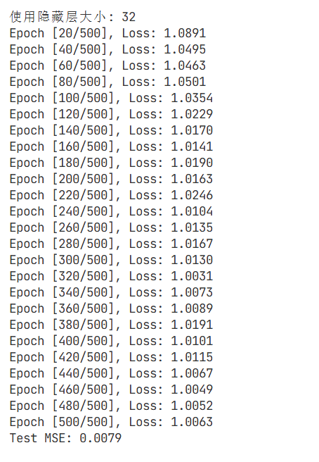
  - 64个神经元：测试MSE较高，拟合能力不好。
  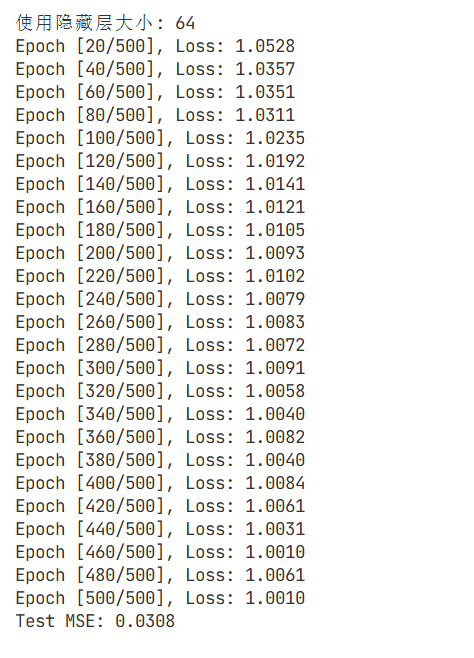
  - 128个神经元：测试MSE适中，拟合能力较好。
  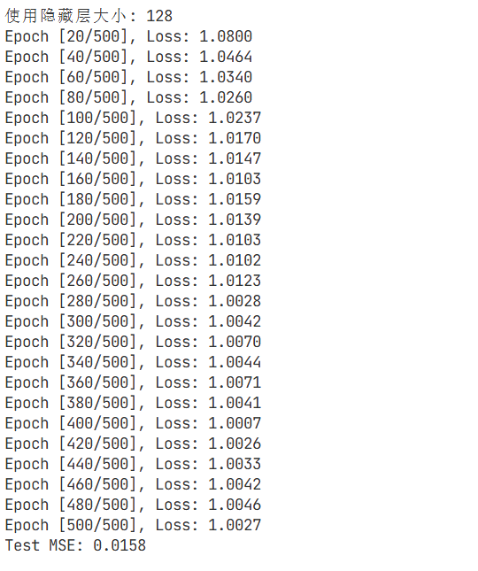
  总体来说，loss差别不大，波动都较小。
  **所以，为什么规模更小的模型拟合效果反而最好呢？是不是因为函数比较简单，不需要复杂的网络结构？复杂的网络结构可能会导致过拟合，而简单的网络结构则能够较好拟合函数。这样的话，为什么128个神经元的模型拟合效果比64个神经元的模型好一些呢？**
- **网络层数**：
  - 2层：测试MSE较高，模型表达能力较差。
  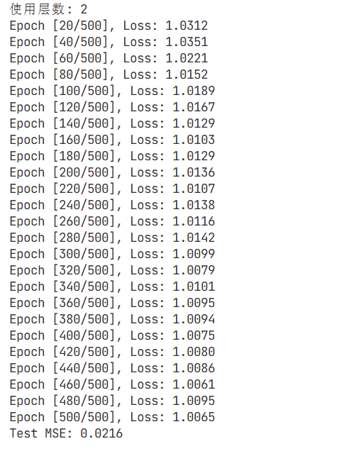
  - 3层：测试MSE较低，模型表达能力适中。
  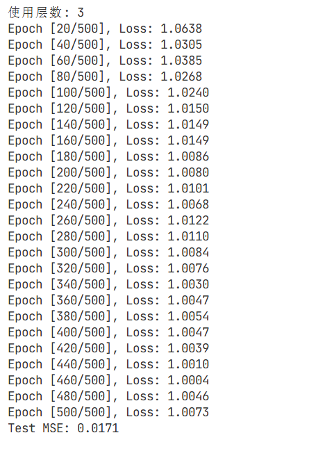
  - 4层：测试MSE最低，模型表达能力最强。
  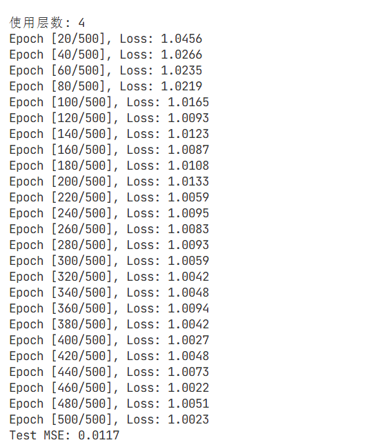
  但是，loss和mse的差别都较小，说明模型的拟合能力较好。没有必要增加网络层数，会增加过拟合的风险，且消耗更多的时间。

**结论**：增加隐藏层大小和网络深度理论上可以提高模型的拟合能力，但对于简单小规模任务，增加隐藏层大小和网络深度的收益可能不明显，同时也可能增加过拟合的风险。

### 3. 噪声对模型拟合的影响


- **噪声添加**：训练集使用高斯噪声来模拟真实世界中的随机干扰（均值为0，标准差为1），通过`np.random.normal(0, 1, size)`生成，测试集使用零噪声，通过`np.zeros(size)`生成。
- **Loss和MSE变化**：由于添加了噪声，训练集上的Loss相对较高（约1.0左右），测试集上的MSE远低于训练集（约0.008-0.03），说明模型能够较好地拟合函数本身，而不是噪声，具有较好的泛化能力 

**结论**：模型具有泛化能力，能够从带噪声的数据中学习到函数的真实特征而忽略噪声的影响。

### 4. 取值范围对模型性能的影响
- 当取值范围从 [-1,1] 扩大到 [-5,5] 时，模型的拟合效果明显下降。通过观察3D曲面图，可以看出，目标函数在更大范围内图像平滑性下降，变化更复杂。
  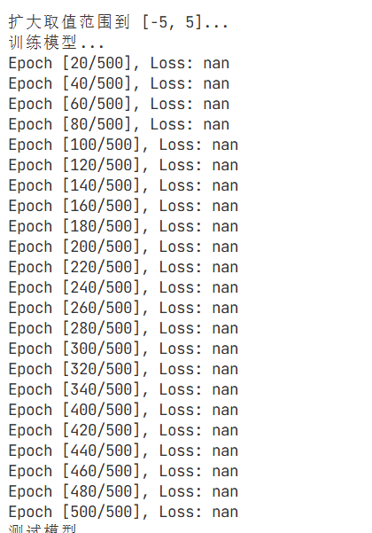  

- 可以看出，当取值范围从 [-1,1] 扩大到 [-5,5] 时，loss和mse都显著增加至溢出，说明模型在更大范围内内的拟合能力急剧下降。

**结论**：对于复杂函数，模型的拟合能力受限于训练数据的取值范围，当超出训练范围时，预测效果会下降。

### 5. 模型拟合能力分析
- 对于目标函数  z = 2x^4 + y^2 + e^{x^2} + 6 ，MLP模型能够较好地拟合其在 [-1,1] 范围内的形态。
- 但对于更大范围的数据，模型的拟合效果下降，需要更复杂的网络结构或更多的训练数据。

**结论**：MLP模型适合拟合中等复杂度的函数，但对于高度非线性或变化剧烈的函数，可能需要其他模型或结构。

## 图像结果

1. **3D曲面图**：`3d_surface.png` - 目标函数在 [-1,1] 范围内的图像。
2. **Loss曲线**：`loss_curves.png` - 不同学习率下的Loss下降曲线。
3. **扩大范围后的3D曲面图**：`3d_surface_large.png` - 目标函数在 [-5,5] 范围内的图像。

## 心得

### 1. 学习率、批大小和网络深度的关系
- **学习率**：学习率是影响模型训练效果的关键参数。过大的学习率会导致模型震荡且mse较高，过小的学习率会导致收敛缓慢且容易陷入局部最优解。在实际应用中，通常需要通过调整学习率进行实验来找到一个适合当前任务的学习率。
- **批大小**：批大小影响模型的训练速度和泛化能力。较小的批大小让参数更新更频繁，有助于模型逃离局部最优解，但训练速度较慢，浪费时间；较大的批大小可以利用并行计算提高训练速度，但可能会导致模型陷入局部最优解。
- **网络深度**：网络深度影响模型的表达能力。更深的网络可以拟合更复杂的函数，但也会增加过拟合的风险。在实际应用中，需要根据任务的复杂度选择合适的网络深度。
**总结**：对于此类简单函数，不需要复杂的网络结构，简单的网络结构则能够较好拟合函数。更改学习率、批大小和网络深度，对于模型的拟合能力改变不明显，可以在复杂的任务中进行更深一步探究。
### 2. 额外学习
- **数据预处理**：对于取值范围较大的数据，可以考虑使用标准化（z = (x - μ) / σ）或归一化处理（z = (x - min) / (max - min)），有助于模型更快收敛。    
- **正则化技术**：为了防止过拟合，可以使用L1、L2正则化或Dropout等技术。
- **优化器选择**：除了SGD，还可以尝试Adam、RMSprop等更高级的优化器，它们在某些任务上可能表现更好。
- **学习率调度**：可以使用学习率调度器，在训练过程中动态调整学习率，如指数衰减（就像下一个任务中采用的）等，这样就不用进行实验来找到最佳的学习率了。
- **模型集成**：可以训练多个不同的模型，然后结合它们的预测结果，提高模型的泛化能力。

