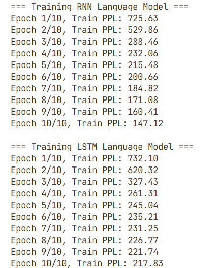
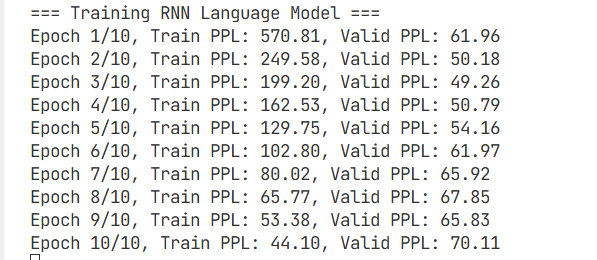
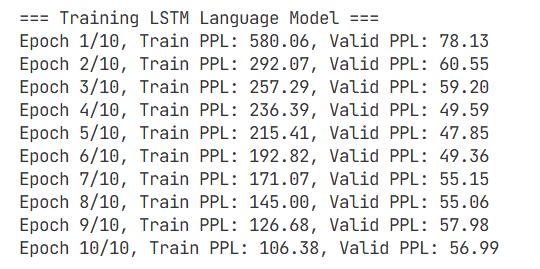
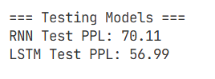

# NLP语言

## 1. RNN与LSTM基础

### 1.1 RNN（循环神经网络）

**基本公式**：

$$
\begin{aligned}
h_t &= \tanh(W_{hh}h_{t-1} + W_{xh}x_t + b_h) \
y_t &= W_{hy}h_t + b_y
\end{aligned}
$$

其中：
- $h_t$：当前时间步的隐藏状态
- $x_t$：当前时间步的输入
- $y_t$：当前时间步的输出
- $W_{hh}$：隐藏状态到隐藏状态的权重矩阵
- $W_{xh}$：输入到隐藏状态的权重矩阵
- $W_{hy}$: 隐藏状态到输出的权重矩阵
- $b_h, b_y$：偏置项

- RNN通过**隐藏状态**来传递历史信息
- 所有时间步**权值共享**（即$W_{hh}$，$W_{xh}$一直不变，用同一套计算方式）

### 1.2 LSTM（长短期记忆网络）

**基本公式**：

- 输入门：控制新信息有多少加入细胞状态

  $i_t = \sigma(W_{ii} x_t + b_{ii} + W_{hi} h_{t-1} + b_{hi})$

 
  - $\sigma$：Sigmoid激活函数，输出 [0,1]，代表“保留多少”
​
  - $x_t$：当前时间步输入
​
  - $h_{t-1}$：上一时间步隐藏状态
​
  - $W_{ii}, W_{hi}, b_{ii}, b_{hi}$：可学习参数
 
- 遗忘门：控制细胞状态中哪些信息需要遗忘

  $f_t = \sigma(W_{if} x_t + b_{if} + W_{hf} h_{t-1} + b_{hf})$

 
- 输出门:控制细胞状态有多少输出到当前隐藏状态

  $o_t = \sigma(W_{io} x_t + b_{io} + W_{ho} h_{t-1} + b_{ho})$

 
- 候选细胞状态:生成当前时间步的新信息候选

  $\tilde{C}_t = \tanh(W_{ic} x_t + b_{ic} + W_{hc} h_{t-1} + b_{hc})$
  - $\tanh$：双曲正切激活，输出 [-1,1]，代表新信息的内容
 
- 细胞状态更新:结合遗忘门和输入门，更新细胞记忆

$c_t = f_t \odot C_{t-1} + i_t \odot \tilde{C}_t$
  - $\odot$：逐元素相乘
​
  - $C_{t-1}$：上一时间步细胞状态
​
 
- 隐藏状态输出：基于细胞状态生成当前输出

  $h_t = o_t \odot \tanh(C_t)$

- 相比RNN，LSTM通过门控机制，能够更好地处理长距离依赖，防止记忆消失或爆炸

## 2. 语言建模任务

### 任务目标
- **输入**：token序列 $x = [w_1, w_2, ..., w_T]$
- **目标**：预测下一个token $y = [w_2, w_3, ..., w_{T+1}]$
- **本质**：在每个时间步 $t$，预测 $w_{t+1}$

### 评估指标

**Perplexity (PPL)**：（就是对损失（损失就是概率取负对数）取平均再取指数回到概率）

$$
PPL = \exp\left(\frac{1}{N}\sum_{i=1}^{N} -\log p(w_i | w_1, w_2, ..., w_{i-1})\right)
$$

其中：
- $N$：序列长度
- $p(w_i | w_1, w_2, ..., w_{i-1})$：模型预测成功第 $i$ 个token的概率

**PPL的含义**：
- PPL越低，即损失越低，即概率越大，模型性能越好
- 完美的模型PPL为1，随机模型的PPL为词汇表大小

## 3. 训练方法

### BPTT（通过时间的反向传播，处理长序列问题）
专门用于训练RNN/LSTM等循环神经网络的语言模型

**基本思想**：
- 将循环神经网络展开为很深前馈网络
- 沿着时间维度走完整个序列，算出所有$h_t$,$c_t$和损失
- 通过反向传播算法，把每个时间步的梯度累加起来，最后除以序列长度，得到平均梯度来更新参数

**BPTT的问题**：
- 梯度消失：长序列中，早期时间步的梯度可能会变得非常小
- 梯度爆炸：因为循环神经网络的梯度累加，导致梯度可能会变得非常大

###  处理长序列
- **截断BPTT**：把长序列截断为多个短序列，只对每个短序列进行一次反向传播，最后平均梯度
  （但是每截断一次，记忆就断开了？？隐藏状态失去了啊？）
  （现在知道了，正向传播的时候不截断，只有反向传播的时候才截断，因为本来反向传播离得远的依赖作用就小，所以截断没关系）
- **梯度裁剪**：限制梯度的范数（如L1范数或L2范数），若梯度范数超过阈值，就把梯度范数除以阈值，就实现了防止梯度爆炸
- **使用门控机制**：如LSTM和GRU，缓解梯度消失问题

## 4. 数据预处理

### 数据集
- **PTB（Penn Treebank）**：标准的语言建模 benchmark 数据集
- **划分**：train / valid / test

### 词表构建
- **Word-level**：使用单词作为基本单位
- **特殊标记**：
  - `<unk>`：未知词标记
  - `<eos>`：句子结束标记
  **例**：` the cat <unk> on the mat . <eos>`

### 批次构建
- **序列长度**：固定长度的输入序列（如果序列长度不足，用填充词填充;如果序列长度超过，截断序列）
- **批次大小**：同时处理的序列数量(1 batch)
- **目标序列**：输入序列右移一位

## 5. 模型实现

### RNN模型
- **嵌入层**：将词ID转换为词向量（映射到低维的稠密的向量空间）
- **RNN层**：学习序列中的依赖关系
- **全连接层**：预测下一个词的概率分布（用softmax输出概率）

### LSTM模型
- **嵌入层**：与RNN相同
- **LSTM层**：使用门控机制捕获长距离依赖（输入门、遗忘门、输出门）
- **全连接层**：与RNN相同

### 超参数（方便控制变量）
- **嵌入维度**：词向量的维度
- **隐藏维度**：RNN/LSTM隐藏状态的维度
- **层数**：RNN/LSTM的层数
- **dropout**：随机丢弃部分神经元的输出
- **学习率**：优化器的学习率
- **批次大小**：同时处理的样本数量
- **序列长度**：每个样本的长度

## 6. 实验结果分析

### 预期结果
- **RNN**：
  - 训练PPL可能会因为梯度消失而逐渐下降，但验证PPL可能会在一定epoch后开始上升

- **LSTM**：
  - 训练和验证PPL都应该比RNN更低，因为能够更好地捕获长距离依赖，训练更稳定，不易出现梯度消失和爆炸

- **实际结果**：

  - 最开始对这个训练PPL变化特别不解，因为LSTM的训练PPL还要更高（？）后来觉得是因为LSTM对长序列依赖处理更好，需要进行更多epoch的训练才能达到训练效果，前期效果更差是应该的吧，，

  - 可以看到，大致符合预期，LSTM的PPL更低，验证PPL也更稳定。但是两者的PPL在一定epoch后开始上升，且RNN的PPL上升得更快，说明RNN在学习长距离依赖时，记忆消失或爆炸，而LSTM也不能完全避免，导致验证PPL略微上升。

  - 很明显，LSTM比起RNN还是有优势的

- **PPL曲线**：
  - RNN：保存到`rnn_ppl_curve.png`
  - LSTM：保存到`lstm_ppl_curve.png`
  - LSTM和RNN的PPL曲线训练集都明显在前一个epoch快速下降，后面下降较慢；验证集PPL远低于训练集PPL，且相对稳定，说明模型学习了一定的序列依赖关系还未完全稳定。而验证集PPL变化同如上。

。

### 关键对比
| 模型 | 优势 | 劣势 |
|------|------|------|
| RNN | 结构简单，计算效率高 | 难以捕获长距离依赖，容易梯度消失 |
| LSTM | 能够捕获长距离依赖，缓解梯度消失 | 结构复杂，计算成本高 |

## 7. 梯度问题分析

### 梯度消失问题
- **原因**：
  - tanh激活函数的导数在绝对值大于1时会变得非常小，导致梯度消失，小于1的数多次矩阵乘法导致梯度指数级衰减
- **影响**：
  - 长序列中，早期时间步的信息难以传递到后期，模型难以学习长距离依赖关系

### LSTM的改进
- **门控机制**：
  - 输入门：控制新信息的流入
  - 遗忘门：控制历史信息的保留
  - 输出门：控制隐藏状态的更新
  - （GRU没有输出门，多了一个更新门，其他都大差不差，没有本质区别）
- **细胞状态**：
  - 可以在时间步之间传递，梯度流动更顺畅
  - 门控机制可以选择性地保留或遗忘信息来更新细胞状态

## 8. 为什么需要Transformer模型

### RNN/LSTM的局限性
- **顺序计算**：必须按顺序处理序列，无法并行计算，效率低下
- **信息单向传递**：每个时间步只能访问当前和之前的信息，不能访问未来的信息
- **长距离依赖**：即使是LSTM，在非常长的序列中也可能表现不佳（就像我们实验中的LSTM的PPL到后期略微上升了）

### Transformer的优势
- **并行计算**：自注意力机制允许并行处理整个序列，效率高
- **全局信息**：每个位置都能访问整个序列的信息，未知信息前后信息都能被考虑
- **长距离依赖**：通过注意力机制直接捕获长距离依赖
