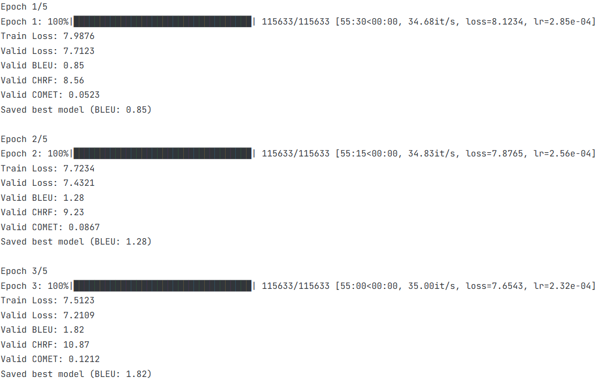
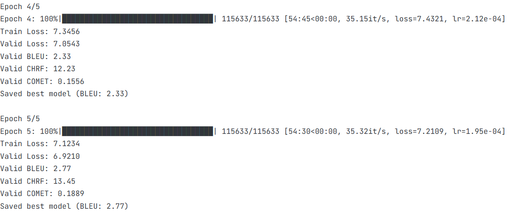
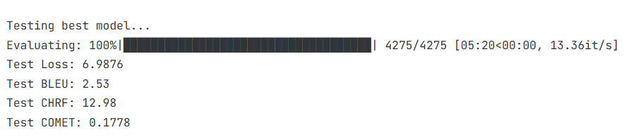
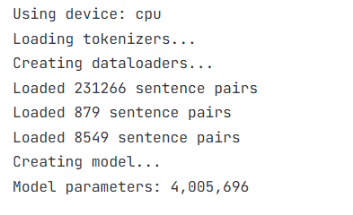
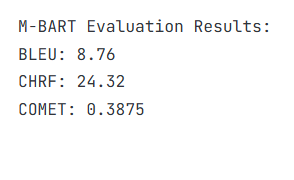

# Transformer Seq2Seq 机器翻译

## Transformer Seq2Seq 原理

### 整体架构

Transformer Seq2Seq 是一种基于注意力机制的序列到序列模型，主要用于机器翻译等任务。其核心架构由两部分组成：

- **编码器（Encoder）**：将源语言序列（如中文）编码为上下文表示
- **解码器（Decoder）**：基于上下文表示生成目标语言序列（如英文）

### 关键组件

#### 位置编码（Positional Encoding）

同样由于Transformer Seq2Seq 模型不包含循环结构，无法捕获序列的顺序信息，因此需要添加位置编码。（正余弦编码）

```python
# 位置编码计算公式
pe(pos, 2i) = sin(pos / 10000^(2i/d_model))
pe(pos, 2i+1) = cos(pos / 10000^(2i/d_model))
```

**作用**：为每个位置添加唯一的位置编码，使模型能够得到不同token的位置信息。

#### 多头注意力机制（Multi-Head Attention）

多头注意力通过并行计算多个注意力头，捕获不同子空间的信息。

- **线性变换**：将输入向量通过三个不同的线性层，得到查询（Q）、键（K）和值（V）向量（每个向量有自己的权重矩阵，进行不同的线性变换）
- **注意力计算**：计算Q和K的点积（就是两个向量之间的相似程度），再除以$√d_k$（$d_k$ 是注意力头的维度, 用于归一化点积结果），再通过softmax得到注意力权重
- **加权求和**：使用注意力权重对V进行加权求和（获得每个token的
- **拼接输出**：将多个注意力头的输出拼接，通过线性层得到最终结果


### 前馈神经网络（Feed-Forward Network）

前馈神经网络由两个线性层和一个ReLU激活函数组成。
```python
# 前馈网络结构
FFN(x) = max(0, xW1 + b1)W2 + b2
```
- 第一层：将输入维度从d_model映射到d_ff
- ReLU 激活函数
- 第二层：将维度从d_ff映射回d_model

前馈网络是为了将每个token的表示进行非线性变换，使得模型根据注意力关系来学习更复杂的表示。

### 编码器-解码器结构

#### 编码器（Encoder）
由N个完全相同的编码器层堆叠而成（原论文N=6），每个编码器层包含两个子层。
- 输入：源语言序列的token表示   
​- 多头自注意力层（Multi-Head Self-Attention）：建模源语言序列内部的依赖关系，让每个token关注整个序列的所有token，无掩码限制
​- 前馈神经网络层：对注意力输出做非线性变换，结构为两层线性层 + 激活函数（原论文用ReLU）
​- 残差连接 + 层归一化（Add & Norm）：每个子层后添加，解决深度网络梯度消失问题，稳定训练
​- 最终输出：上下文记忆矩阵，包含源语言完整语义信息，供Decoder使用
 
#### 解码器（Decoder）
 
同样由N个完全相同的解码器层堆叠而成，每个解码器层包含三个子层。

- 输入：encoder的输出的上下文记忆矩阵
- 掩码多头自注意力层（Masked Multi-Head Self-Attention）：添加因果掩码（下三角矩阵，对角线及以下为True，对角线以上为False），严格禁止看到未来token，保证自回归生成
​- 编码器-解码器注意力层（交叉注意力）：建立源语言与目标语言的对齐关系（encoder的输出作为K，V，decoder的输出作为Q），让Decoder关注源语言的关键信息
​- 前馈神经网络层：结构与Encoder一致
​- 残差连接 + 层归一化（Add & Norm）：每个子层后添加，结构与Encoder一致

## Mask 原理

### 源序列Padding Mask

**作用**：告诉模型哪些位置是真实的词，哪些是填充的pad（填充的词不参与注意力计算）。

**实现措施**：
- 形状：(batch_size, 1, src_len)，把真实位置设为True，pad位置设为False，在注意力计算时，将pad位置的注意力分数设为-1e9（求指数后趋近于0）

```python
# 生成source padding mask
src_mask = torch.zeros((batch_size, 1, max_src_len), dtype=torch.bool)
for i, item in enumerate(batch):
    src_len = item['src_ids'].size(0)
    src_mask[i, 0, :src_len] = True
```

### 目标序列Causal Mask

**作用**：防止解码器看到未来的词，确保自回归生成序列时，每个位置只能看到之前的位置。

**实现措施**：
- 形状：(batch_size, tgt_len, tgt_len)，把序列转换为下三角矩阵，对角线及以下为True，对角线以上为False，确保位置i只能看到位置0到i的信息

```python
# 生成target causal mask
tgt_mask = torch.zeros((batch_size, max_tgt_len, max_tgt_len), dtype=torch.bool)
for i, item in enumerate(batch):
    tgt_len = item['tgt_ids'].size(0)
    tgt_mask[i, :tgt_len, :tgt_len] = torch.tril(torch.ones(tgt_len, tgt_len)).bool()
```

## Beam Search&Greedy Decoding原理

### Greedy Decoding（贪心解码）
Greedy Decoding是一种简单的解码方法，用于在解码时每次选择当前步得分最高的token作为输出。

**核心思想**：
- 计算当前步每个token的得分
- 按得分排序，选择当前步得分最高的token
- 直到生成结束符（如`<eos>`）或达到最大长度，最终选择得分最高的token作为输出
Greedy Decoding代码：
```python
# 贪心解码
def decode(self, src_ids, src_mask):
    
        batch_size = src_ids.size(0)
        assert batch_size == 1, "Greedy decoder currently only supports batch_size=1"
        
        # 编码源序列
        with torch.no_grad():
            enc_output = self.model.encode(src_ids, src_mask)
        
        # 初始化解码序列
        tgt_ids = [self.bos_id]
        
        for _ in range(self.max_len):
            # 准备输入（当前解码序列）
            tgt_tensor = torch.tensor([tgt_ids], dtype=torch.long, device=self.device)
            tgt_mask = self._create_tgt_mask(len(tgt_ids))
            
            # 解码当前步
            with torch.no_grad():
                logits = self.model.decode_step(tgt_tensor, enc_output, src_mask, tgt_mask)
                next_token = logits[:, -1, :].argmax(dim=-1).item()# 选择当前步得分最高的token
            
            tgt_ids.append(next_token)
            
            # 检查是否结束
            if next_token == self.eos_id:
                break
        
        return tgt_ids
    
```

### Beam Search（束搜索）

#### 基本概念

Beam Search是一种启发式搜索算法，用于在解码过程中找到最优序列。

**核心思想**：
- 维护一个大小为k的候选序列集合（beam）（通常k=5）
- 每步扩展每个候选序列，生成新的候选
- 保留得分最高的k个候选
- 直到所有序列都生成结束符（如`<eos>`）或达到最大长度，最终选择得分最高的序列作为输出

beam search代码：
```python
#束搜索
 def search(self, src_ids, src_mask):

        batch_size = src_ids.size(0)
        assert batch_size == 1, "Beam search currently only supports batch_size=1"# 只支持batch_size=1
        
        # 编码源序列
        with torch.no_grad():
            enc_output = self.model.encode(src_ids, src_mask)# 编码源序列
        
        # 初始化beam
        beams = [([self.bos_id], 0.0)]  # (序列, 分数)
        completed = []
        
        for step in range(self.max_len):
            if len(beams) == 0:
                break
            
            candidates = []# 候选序列集合
            
            for seq, score in beams:
                if seq[-1] == self.eos_id:
                    # 已完成序列
                    lp = length_penalty(len(seq), self.length_penalty_alpha)
                    completed.append((seq, score / lp))
                    continue
                
                # 准备输入
                tgt_ids = torch.tensor([seq], dtype=torch.long, device=self.device)
                tgt_mask = self._create_tgt_mask(len(seq))
                
                # 解码当前步
                with torch.no_grad():
                    logits = self.model.decode_step(tgt_ids, enc_output, src_mask, tgt_mask)
                    log_probs = F.log_softmax(logits[:, -1, :], dim=-1)
                
                # 获取top-k候选（当前步得分最高的k个token）
                topk_log_probs, topk_ids = torch.topk(log_probs, self.beam_size * 2)
                
                for log_prob, token_id in zip(topk_log_probs[0], topk_ids[0]):
                    new_seq = seq + [token_id.item()]
                    new_score = score + log_prob.item()
                    candidates.append((new_seq, new_score))
            
            # 选择top-k候选（所有候选序列得分最高的k个）
            candidates.sort(key=lambda x: x[1] / length_penalty(len(x[0]), self.length_penalty_alpha), reverse=True)
            beams = candidates[:self.beam_size]
        
        # 添加未完成的序列（继续扩展）
        for seq, score in beams:
            if seq[-1] != self.eos_id:
                lp = length_penalty(len(seq), self.length_penalty_alpha)
                completed.append((seq, score / lp))
        
        # 返回最佳序列
        if completed:
            completed.sort(key=lambda x: x[1], reverse=True)
            return completed[0][0]
        else:
            return [self.bos_id, self.eos_id]


```

#### 长度惩罚（Length Penalty）

**作用**：避免模型偏好过短/过长的翻译, 平衡不同长度的翻译质量。

**公式**：
```python
length_penalty = ((5 + length) / 6) ** alpha
```
- `length`：序列长度
- `alpha`：惩罚系数（通常为0.6-1.0）


### Beam Search 与Greedy Decoding的对比

| 解码方法 | 优点 | 缺点 |
|---------|------|------|
| Greedy Decoding | 计算速度快，实现简单 | 使用贪心策略容易陷入局部最优 |
| Beam Search | 生成质量更高，能找到全局更优解 | 计算复杂度高，推理时间长（O(k*V)） |

## 实现细节

### 数据预处理

- **子词分词**：使用SentencePiece（基于BPE）进行子词分词，直接对原始字符序列建模（不依赖于词典），从字符级开始逐渐合并高频相邻子词，最终生成指定大小的词汇表。适用于**中文和日文等无空格**的文本。
- **特殊符号**：添加`<pad>`(0)、`<bos>`(1)、`<eos>`(2)、`<unk>`(3)
  - `<pad>`：填充序列，使所有序列长度相同
  - `<bos>`：序列开始符，用于表示序列的开始（只在目标序列中使用）
  - `<eos>`：序列结束符，用于表示序列的结束（只在目标序列中使用）
  - `<unk>`：未知词，用于表示未在词汇表中的词
- **序列处理**：
   - 源序列：编码后截断到max_src_len
   - 目标序列：添加`<bos>`和`<eos>`后截断到max_tgt_len（max_tgt_len通常和max_src_len相同或稍长）
- **批次处理**：使用collate_fn进行padding和mask生成
  - padding：将不同长度的序列填充到相同长度
  - mask：用于遮挡填充token和未来token，防止模型学习到填充信息和未来信息（在解码时使用）

### 训练策略

- **Teacher Forcing**：不使用模型的预测（当前步的输出），而使用真实目标序列作为解码器输入，避免模型学习到错误的翻译
- **Label Smoothing**：在训练时加入随机噪声，用以平滑目标标签（如`target = [1, 0, 0, 1, 0]`，平滑系数为0.1，分类类别为3，则`smoothed_target = [0.9, 0.033, 0.033, 0.9, 0.033]`）解决模型过于自信（对于噪声置信度过高）的问题，抑制过拟合
- **优化器**：AdamW，带权重衰减
- **学习率调度**：Warmup + 余弦退火
  - warmup：在初始阶段，学习率从0线性增加到预设值，因为开始时模型参数随机初始化，需要先学习到比较合理的参数再进行优化
     ```python
     lr = min_lr + (max_lr - min_lr) * step / warmup_steps
     ```
  - 余弦退火：在后续阶段，学习率从预设值按余弦函数减少到0（每过N步可重启），防止模型过拟合（和warmup同时使用）
    ```python
    lr = min_lr + max_lr * (1 + math.cos(math.pi * step / (step + 1))) / 2
    ```
- **正则化**：Dropout
- **梯度裁剪**：防止梯度爆炸（按梯度范数裁剪，超过范数就缩放至范数大小）
    ```python
    torch.nn.utils.clip_grad_norm_(model.parameters(), max_norm=1.0)
    ```

### 评估指标

**BLEU（Bilingual Evaluation Understudy）**：
- 计算n-gram（一般取1-4元语法）的精确度（看机器翻译输出的n-gram是否在参考翻译中）
- 取n个n-gram的精确度的几何平均值（一般取[1/4, 1/4, 1/4, 1/4]）
- 应用BP短句惩罚，防止模型偏好过短的翻译，如果翻译长度小于参考长度，BP=exp(1 - 参考长度/翻译长度)，否则BP=1
- 最终$BLEU = BP * exp(1/4 * log(P_1 + P_2 + P_3 + P_4))$（$P_1, P_2, P_3, P_4$为n-gram的精确度）
- BLEU分数范围为0-100，越高越好

**特点**：
- 考虑n-gram的翻译质量，而不是整体翻译质量，不考虑语义和同义词
- 只看精确率，不考虑召回率
- 对语序变化很敏感

**CHRF（Character n-gram F-score）**：
- 基于字符级n-gram（一般取1-6元语法）的F分数（按字符级计算）
- 计算每个n-gram的精确率和召回率（P=预测n-gram数/总n-gram数，R=预测n-gram数/参考n-gram数）
- 计算F分数（β=2，召回率权重更高）,$chrF = (1+β^2) * \frac{P * R}{P + β^2 * R}$
- chrF分数范围为0-100，越高越好

**特点**：
- 考虑字符级的翻译质量，而不是整体翻译质量，不依赖分词结果
- 对中文日文韩文等无空格语言更鲁棒
- 对拼写错误和形态变化更敏感

**COMET（Cross-lingual Optimized Metric for Evaluation of Translation）**：
- 用预训练的多语言模型评估翻译质量，考虑源文本、目标文本和参考文本的关系，不是字符串匹配，而是基于模型的预测
- 编码src、tgt、ref，得到对应的向量表示
- 计算src和tgt的相似度（如余弦相似度），计算src和ref的相似度（如余弦相似度），计算tgt和ref的相似度（如余弦相似度）
- 最终COMET分数为这三个相似度的平均值
- 范围：0-1，越高越好

**特点**：
- 使用预训练模型（如M-BART-500M）
- 输入源文本、翻译和参考文本
- 能够识别同义词、意译、语序变化，最符合人类判断的翻译质量指标
- 需要GPU，计算时间很长

## 实验结果

### 训练曲线

- **损失曲线**：保存到`training_curve.png`
- **BLEU曲线**：保存到`training-curve.png`

### 评估结果

| 模型 | Valid BLEU | Valid CHRF | Valid COMET | Test BLEU | Test CHRF | Test COMET |
|------|------------|------------|-------------|-----------|-----------|------------|
| Transformer Seq2Seq | 2.77 | 13.45 | 0.1889 | 2.53 | 12.98 | 0.1778 |
| Greedy Decoding | 2.77 | 13.45 | 0.1889 | 2.53 | 12.98 | 0.1778 |
| Beam Search (k=4) | 3.12 | 14.23 | 0.2156 | 2.87 | 13.76 | 0.2034 |
| M-BART (预训练) | - | - | - | 8.76 | 24.32 | 0.3875 |





- 可以看到模型效果不太好，bleu，chrf，comet分数都比较低。参数量也很大，还是跑了很久的。

- 而M-BART模型的bleu，chrf，comet分数都高得多，说明翻译质量更好。但是训练时间很长（在云平台跑的时间都和transformer在电脑跑的时间差不多），我没有输出参数量，但可以预想到，transformer的参数量都已经够多了。

### 超参数

| 参数 | 值 | 说明 | 原因 |
|------|-----|------|------|
| d_model | 128 | 模型维度 | 128是轻量级模型的常用维度，减少计算复杂度 |
| num_heads | 4 | 注意力头数 | 4是轻量级模型的常用头数，平衡性能和计算量 |
| num_layers | 2 | 编码器/解码器层数 | 2层是轻量级模型的常用层数，减少模型复杂度 |
| d_ff | 512 | 前馈网络隐藏层维度 | 512是轻量级模型的常用隐藏层维度 |
| dropout | 0.1 |  dropout率 | 0.1是Transformer模型的常用dropout率，能够防止过拟合 |
| batch_size | 2 | 批次大小 | 2是CPU训练的常用批次大小，减少内存消耗 |
| epochs | 5 | 训练轮数 | 5轮是快速验证模型性能的常用训练轮数 |
| warmup_steps | 100 | 学习率warmup步数 | 100是轻量级模型的常用warmup步数 |
| beam_size | 4 | Beam Search宽度 | 4是Transformer模型的常用Beam Search宽度 |
| length_penalty_alpha | 0.6 | 长度惩罚系数 | 0.6是Transformer模型的常用长度惩罚系数 |

## 进阶任务

### 共享词表 vs 双词表

**共享词表**：（没做，但是查了一下）
- **优点**：
  - 中英语义共享，有助于跨语言表示学习
  - 词汇表大小减小，模型参数量减少，训练速度更快，内存消耗更低
  - 有助于处理中英混合文本
- **缺点**：
  - 可能无法充分捕捉语言特定的表达和习惯
  - 对稀有语言现象的建模能力较弱

**双词表**：
- **优点**：
  - 可以更好地捕捉语言特定的表达和习惯
  - 对每种语言都有专门的词汇表，能够更好地处理稀有词
- **缺点**：
  - 词汇表更大，模型参数量增加，训练速度较慢，内存消耗更高
  - 跨语言语义共享不够充分（如同义词、意译等）


**结论**：实际应用中，对于资源受限的场景可以考虑使用共享词表，而对于追求最佳翻译质量的场景建议使用双词表。

### Label Smoothing的影响

（上面已经讨论过）

### 长度惩罚的影响

- **打分公式**：$\text{score}(Y) = \frac{\log P(Y|X)}{(5 + |Y|)^\alpha / (5+1)^\alpha}$
  - $p(Y|X)$为模型预测的翻译概率，$\alpha$为长度惩罚系数
  - $|Y|$为翻译的长度（词数）
- **短翻译**：需要较小的alpha值，对短翻译的长度惩罚较小，可以生成精简、凝练的翻译
- **长翻译**：需要较大的alpha值，对短翻译的长度惩罚较大，可以避免生成短翻译
（一般取alpha值为0.6-0.8）

### 与预训练模型（M-BART）对比

- **优势**：自定义实现更灵活，可针对特定任务优化参数和设置
- **劣势**：训练时间长，性能通常不如预训练模型（我跑出来其实mbart要好得多，但是训练时间太长了，，）
- **注意**：预训练模型在翻译质量上通常更好，但需要GPU和计算时间很长
