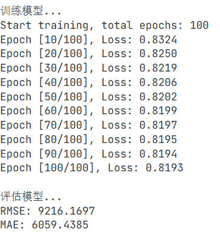
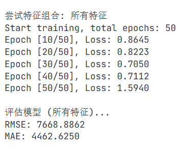
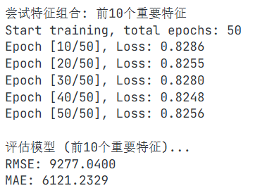
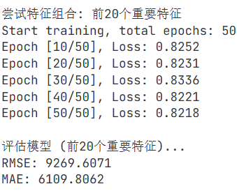
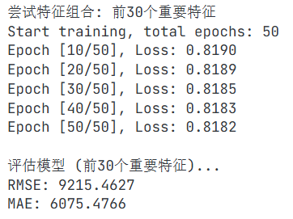
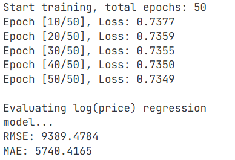

# Linear Regression
。

## 1.下载并检查数据集
#### 数值型特征
- 建筑面积（平方米）：连续数值，范围从36.26到271.09平方米
- 单价（元/平方米）：连续数值，范围从2900到37500元/平方米
- 挂牌时间：部分为数字格式（如44248），部分为日期格式（如2021/12/3） （需要统一为日期格式）

#### 类别型特征
- 房屋所属市辖区：包含多个市辖区
- 房屋地址（街道）：包含多个街道  
- 房屋户型：格式为"X室X厅1厨X卫"，如3室2厅1厨1卫
- 所在楼层：格式为"楼层类型 (共X层)"，如高楼层 (共6层)
- 户型结构：平层、跃层、错层
- 建筑类型：板楼、塔楼、板塔结合、平房
- 房屋朝向：南、北、东南、西南、东北、西北、南 北、东 西等
- 建筑结构：砖混结构、框架结构、钢混结构、混合结构、未知结构
- 装修情况：毛坯、简装、精装、其他
- 配备电梯：有、无
- 交易权属：商品房、拆迁安置房、经济适用房、已购公房、限价商品房
- 房屋用途：普通住宅

#### 一致性
- **面积单位**：统一为平方米（m²）
- **价格单位**：统一为元/平方米
- **其他单位**：楼层信息包含总层数，格式统一为"楼层类型 (共X层)"，如"高楼层 (共6层)"
- **数据格式**：大部分字段格式一致，但挂牌时间存在两种格式（数字和日期）
#### 缺失值或异常值
- **缺失值**：未发现
- **异常值**：
  - 建筑结构中有"未知结构"（需要填充）
  - 挂牌时间格式不一致：部分为数字（如44248），部分为日期格式（如2021/12/3）（需要统一为日期格式）
  - 装修情况中有"其他"（需要填充）
  - 建筑类型中有"平房"（需要填充）
  - 单价存在较大差异：最低2900元/平方米，最高37500元/平方米（需要处理异常值）


### 2.特征工程与数据处理

#### 数据加载与预处理
- **数据读取**：支持直接接收DataFrame对象
- **缺失值处理**：
  - 数值型特征（如建筑面积）：使用均值填充
  - 类别型特征：使用众数填充
- **异常值处理**：
  - 使用IQR方法检测异常值
  - 用中位数替换异常值
- **特征工程**：
  - 数值特征标准化：对建筑面积进行Z-score标准化
  - 类别特征One-Hot编码：对以下特征进行独热编码
    - 房屋户型
    - 所在楼层
    - 户型结构
    - 建筑类型
    - 房屋朝向
    - 建筑结构
    - 装修情况
    - 配备电梯
    - 交易权属
    - 房屋用途
- **特征列管理**：
  - 训练时保存特征列名
  - 测试时确保特征列与训练时一致，缺失列填充为0

#### 特征工程具体实现
```python
// 处理缺失值
def handle_missing_values(self, df):
   
    # 数值型特征用均值填充
    numerical_cols = ['建筑面积（平方米）']
    for col in numerical_cols:
        if col in df.columns:
            df[col] = df[col].fillna(df[col].mean())
        
    # 类别型特征用众数填充
    categorical_cols = ['房屋户型', '所在楼层', '户型结构', '建筑类型', 
                          '房屋朝向', '建筑结构', '装修情况', '配备电梯', 
                          '交易权属', '房屋用途']
    for col in categorical_cols:
        if col in df.columns:
            df[col] = df[col].fillna(df[col].mode()[0] if not df[col].mode().empty else '未知')
        
    return df
    
// 处理异常值
def handle_outliers(self, df, col):
    
    # 确保是数值类型
    df[col] = pd.to_numeric(df[col], errors='coerce')
        
    if df[col].count() > 0:
        Q1 = df[col].quantile(0.25)
        Q3 = df[col].quantile(0.75)
        IQR = Q3 - Q1
        lower_bound = Q1 - 1.5 * IQR
        upper_bound = Q3 + 1.5 * IQR
            
        # 用中位数替换异常值
        df[col] = np.where((df[col] < lower_bound) | (df[col] > upper_bound), 
                            df[col].median(), df[col])
        
    return df
    
// 特征工程：标准化数值特征和One-Hot编码
def feature_engineering(self, df):
    # 标准化数值特征
    numerical_cols = ['建筑面积（平方米）']
    for col in numerical_cols:
        if col in df.columns:
            mean = df[col].mean()
            std = df[col].std()
            if std > 0:
                df[col] = (df[col] - mean) / std
    
    # 类别特征One-Hot编码
    categorical_cols = ['房屋户型', '所在楼层', '户型结构', '建筑类型', 
                      '房屋朝向', '建筑结构', '装修情况', '配备电梯', 
                      '交易权属', '房屋用途']
    
    for col in categorical_cols:
        if col in df.columns:
            # 创建One-Hot编码
            one_hot = pd.get_dummies(df[col], prefix=col)
            # 合并到原数据框
            df = pd.concat([df, one_hot], axis=1)
            # 删除原始列
            df.drop(col, axis=1, inplace=True)
    
    return df
```


### 3.数据集划分与张量转换

#### 数据集划分
- 使用`train_test_split`将数据集划分为训练集和测试集（80%/20%）
- 设置`random_state=42`确保结果可复现

#### 目标变量标准化
- 对目标变量（单价）进行Z-score标准化
- 使用训练集的均值和标准差对测试集进行标准化

#### 张量转换
- 将特征和标签转换为PyTorch张量
- 对标签增加维度以匹配模型输出形状

#### 数据加载器
- 使用`DataLoader`按批次加载数据
- 设置`batch_size=64`和`shuffle=True`（随机打乱数据）

### 4.模型搭建

#### 模型结构
```python
class LinearRegression(nn.Module):
    def __init__(self, input_dim):
        super(LinearRegression, self).__init__() 
        self.linear = nn.Linear(input_dim, 1)  # 1个输出
    
    def forward(self, x):
        return self.linear(x)
```

#### 损失函数与优化器
- **损失函数**：均方误差损失（`nn.MSELoss()`）
- **优化器**：Adam优化器，学习率0.001

### 5.训练框架与参数调整

#### 训练参数
- **训练轮数**：100轮
- **学习率**：0.001（初始学习率，采用学习率衰减）
```python
# 学习率衰减
def step_decay(epoch, initial_lr, decay_rate=0.1):
    return initial_lr * (decay_rate ** epoch)
```
- **批大小**：64(过大会导致内存不足，过小会导致训练时间过长)


#### 训练曲线
- 记录每个epoch的平均损失
- 每10轮打印一次损失（观察到Loss几乎不变且数值较小，训练效果较好，但评估时mae和rmse都很大，说明模型在测试集上的预测能力较差。是否意味着轮次太多，模型过拟合？）

**可以看到，mae和rmse都好大，说明模型在测试集上的预测能力较差。**

### 6.模型评估与预测

#### 模型评估

- 计算评估指标：
  - 均方根误差（RMSE）：公式：$\sqrt{\frac{1}{N}\sum_{i=1}^{N}(y_i - \hat{y}_i)^2}$
  - 平均绝对误差（MAE）：公式：$\frac{1}{N}\sum_{i=1}^{N}|\hat{y}_i - y_i|$
- 反标准化预测值和真实值：（将标准化后的预测值和真实值转换为原始单位）
```python
# 反标准化预测值
y_pred = (y_pred * std) + mean
# 反标准化真实值
y_true = (y_true * std) + mean  
```

#### 新样本预测
- 构建新样本数据：
```python
# 新样本数据
new_sample = pd.DataFrame({
    '建筑面积（平方米）': [100],
    '所在楼层': ['1'],
    '户型结构': ['1室1厅'],
    '建筑类型': ['普通建筑'],
    '房屋朝向': ['东'],
    '建筑结构': ['普通建筑'],
    '装修情况': ['普通装修'],
    '配备电梯': ['有'],
    '交易权属': ['有'],
    '房屋用途': ['普通房屋']
})
```
- 使用`ChengduHouseDataset`进行预处理
- 转换为张量并进行预测
- 反标准化预测结果：（将预测值转换为原始单位）
```python
# 反标准化预测值
y_pred = (y_pred * std) + mean
```

ok，一个离大谱的数字，雀氏效果很差，但是为什么呢？？因为用的最简单线性层？


### 7.拓展与挑战

#### 不同特征组合
- 先提取不同特征的重要性：（使用`feature_importance`函数提取不同特征的重要性程度）
- 对不同特征组合进行评估：（使用`cross_val_score`函数评估不同特征组合的模型性能）
- 选择最佳特征组合：（根据评估结果选择性能最好的特征组合）





看得出用的特征越多，确实模型的预测能力会提高（但是模型过拟合了（应该是吧？），预测能力很差）

#### log(price)回归
- 对目标变量取对数：`y_log = np.log1p(y)`
- 训练模型并评估
- 使用`np.expm1`进行反变换：（将对数后的预测值转换为原始单位）
```python
# 反变换预测值
y_pred = np.expm1(y_pred)
```

看到经过log回归后，预测效果有明显提升

#### 特征可视化
- **价格分布直方图**：保存为`price_distribution.png`
- **面积-价格散点图**：保存为`area_price_scatter.png`
- **特征重要性图**：保存为`feature_importance.png`

### 8.可视化观察结论

#### 训练损失曲线分析
- 训练损失随着轮次的增加逐渐下降，损失在前5轮急剧下降，然后就趋于稳定，表明模型已经基本收敛（是不是说明可以大量减少训练轮数，以提高训练效率？？？但是现实看来，模型在测试集上的预测能力很差，模型过拟合成啥样了！！），初期损失下降较快，后期下降缓慢，符合模型训练的一般规律

#### 价格分布分析    
- **分布形态**：房价分布呈现左偏态，大部分房屋单价集中在10000-20000元/平方米之间
- **异常值**：存在少量高价房屋（单价超过30000元/平方米），符合实际市场情况
- **数据覆盖**：价格范围从2900元/平方米到37500元/平方米，覆盖了不同档次的房屋

#### 面积-价格关系分析
- **相关性**：建筑面积与单价之间存在一定的正相关关系，但相关性不强（图中显示的点分布较为分散），说明面积不是决定房价的主要唯一因素，存在一些面积较小但单价较高的房屋（异常值），可能是由于其他因素影响

#### 特征重要性分析
- **重要特征**：建筑面积、房屋朝向、装修情况等特征对房价预测有较大影响
- **特征贡献**：不同特征的重要性程度不同，合理利用重要特征可以提高模型性能

#### 模型性能评估
- **预测准确性**：模型在测试集上的RMSE和MAE值非常非常大，表明预测结果完全不准确（19w的成都房价？？）
- **改进空间**：或许可以通过增加更多特征、尝试更加复杂的模型结构等方式进一步提高预测精度
